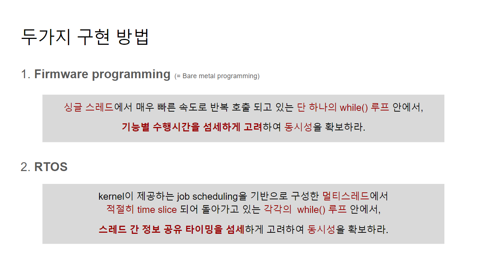

RTOS 프로그래밍 프로젝트: 엘레베이터 만들기
==========
## 프로젝트 설명
프로젝트 수행자: intel Edge AI SW 개발자 아카데미 (3기_권강현) 
 
프로젝트 수행기간: 24/01/23 ~ 24/01/25 
 

## 프로젝트 시연 영상
(아래 이미지를 클릭하시면 유튜브로 이동합니다.) 
 
 

## 프로젝트 발표 자료
(아래 이미지를 클릭하시면 구글 슬라이드로 이동합니다.) 
 
 

## 프로젝트 발표 영상
(아래 이미지를 클릭하시면 유튜브로 이동합니다.) 
 
 
